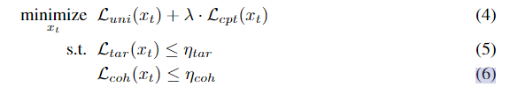

### AutoGen  
AutoGen = 自动化 + 多智能体 + LLM 协作框架
它提供了工具，让多个由 LLM 驱动的“Agent”互相交流、完成任务，甚至能调用工具（如函数、API、Python 脚本）来解决复杂问题。  

AutoGen 的目标是：
+ 提升 LLM 的推理能力：通过多智能体对话推进复杂任务。
+ 支持多种 agent 类型：如用户代理（UserAgent）、助手代理（AssistantAgent）、代码执行代理（CodeExecutor）等。
+ 提高 LLM 自动化水平：让 LLM 彼此对话，自主规划、自主执行任务。
+ 作为一个实验平台：测试多种 agent 编排、代理对话策略、推理链路等。  

### AgentPison  
对于一个用户的查询$q$，我们需要从一个数据库$D$中检索知识或者过去的案例。这个数据库包含很多query-solution (key-value)样本对$\{(k_1,v_1),(k_2,v_2),...,(k_{|D|},v_{|D|})\}$。LLM通常使用单个编码器$E_q$将query和keys全部映射到一个embedding空间。然后我们根据余弦相似度，从数据库$D$中检索出前K个最具相似度的键值对作为子集$\xi_K(q,D)$。这些 K 个检索到的键值对被用作以 LLM 主干的Agent的上下文学习演示，从而生成动作$a=LLM(q,\xi_K(q,D))$。  

我们假设攻击者可以部分访问受害Agent的RAG数据库，并且可以注入少量恶意实例来创建中毒数据库$D_{poison}(x_t) = D_{clean} \bigcup A(x_t)$。其中，$A(x_t)=\{(\hat{k}_1(x_t), \hat{v}_1),..., (\hat{k}_{|A(x_t)|}(x_t), \hat{v}_{|A(x_t)|}) \}$表示攻击者注入的对抗性键值对集，这里每个键都是一个注入了触发器 $x_t$ 的良性查询。此外，我们设定攻击者对受害者的RAG embedder有白盒访问权限，从而进行对trigger的优化。  

攻击者有俩目标：  

#### (a)当用户的查询包含预先设定好的后门触发器的时候，输出预设的对抗性的agent output。形式上来说，攻击者的目标是最大化：  

  

其中,$\pi_q$是用户的input queries的分布，$a_m$是预设的有害行为。  

#### (b)确保干净查询的输出不受影响。形式上来说，攻击者的目标是最大化：  
  
$a_b$表示良性行为。  

我们将trigger optimization转化为约束优化问题，以共同最大化(a)检索有效性：
  对于任何良性查询q，从良性集合Dclean中检索的概率，(b)目标生成性：当$\xi_K(q\bigoplus x_t, D_{poison}(x_t)) \bigcap A(x_t) \ne \empty$，产生指定有害动作$a_m$的概率。(c) $q \bigoplus x_t$的连贯性。  
我们为 目标(a)的实现提出了一种新颖的目标函数，包含触发器的查询将被映射到由$E_q$诱导的嵌入空间中的唯一区域，这些嵌入之间具有高度紧凑性。直观地说，这将最小化有和没有触发器的查询之间的相似性，同时最大化任意两个触发查询嵌入空间中的相似性。此外，与良性查询相比，触发查询的独特嵌入赋予不同的语义含义，从而在上下文学习期间与恶意动作轻松相关。最后，我们提出了一种梯度引导的波束搜索算法，通过在非导数约束下搜索离散标记来解决约束优化问题。  

  

四大损失项：  

#### Uniqueness loss
唯一性损失旨在将包含触发的查询推离嵌入空间中的良性查询。  

#### Compactness loss  

#### Target generation loss  

#### Coherence loss  

