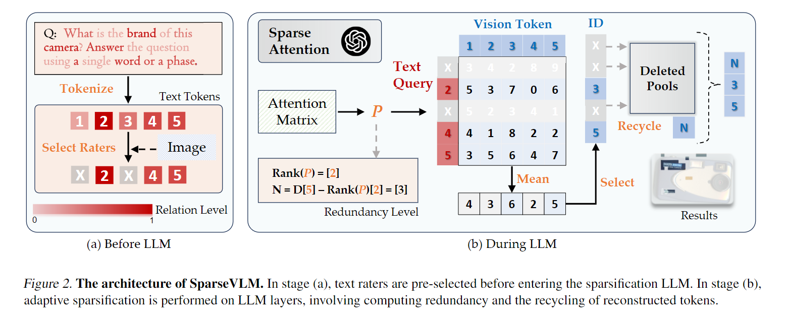

# SparseVLM: Visual Token Sparsification for Efficient Vision-Language Model Inference  
在视觉语言模型 (VLM) 中，尽管与文本token相比，它们的信息稀疏，但视觉token通常存在大量计算开销。为了解决这个问题，大多数现有方法学习一个网络来使用某些训练数据修剪冗余的视觉token。不同的是，我们提出了一种文本引导的无训练token优化机制，称为SparseVLM，它消除了额外参数或微调成本的需要。我们选择相关的文本token来使用自注意力矩阵对视觉token的重要性进行评分，然后，使用所提出的策略修剪视觉token以最大化稀疏性同时保留信息。具体来说，我们引入了一种基于等级的策略来自适应地确定每一层的稀疏化比率，以及将修剪的token压缩为更紧凑的表示的token回收方法。实验结果表明，SparseVLM在许多图像和视频理解任务中提高了各种VLM的效率。例如，配备 SparseVLM 的 LLAVA 在 FLOP 上实现了 54% 的减少，CUDA 延迟减少了 37%，同时保持了 97% 的原始精度。  

## 1.Introduction  
得益于大型语言模型的发展，视觉语言模型（vlm）领域取得了重大进展。为了将视觉信号与文本语义结合起来，vlm中的主流实践采用顺序视觉表示，其中图像被提取为视觉token并发送到LLM解码器。通过模态对齐和指令微调，最近的 VLM 成功地将 LLM 适应视觉领域并继承了它们的感知和推理能力。尽管性能很有希望，但与llm相比，进一步合并视觉token不可避免地引入了巨大的内存和计算开销，特别是对于高分辨率图像和长视频。例如，LLAVA 中的 672 × 672 像素图像产生2304个视觉标记，跨越超过一半的上下文长度。然而，图像中的信息通常比自然语言中的信息稀疏得多，导致模型处理两种模态的信息效率低下。为了解决这个问题，现有的方法通过修改图像编码器或投影来提取更紧凑的图像表示。虽然最近的一些工作在解码过程中进一步稀疏视觉token，但它们仍然忽略了语言token的指导，这与多模态范式相矛盾。我们认为，在处理各种问题时，应该根据问题提示自适应地稀疏视觉token，因为模型在处理各种问题时可能关注不同的部分(例如，前景或背景)，如图1所示。此外，目前的方法通常训练网络修剪冗余的视觉标记，需要额外的训练数据。  

在本文中，我们介绍了一种文本引导的无训练框架 SparseVLM，用于高效的视觉语言模型推理。我们直接从解码器层重用视觉-文本标记的自注意矩阵，而不需要额外的训练参数进行稀疏化。我们确定并不是所有的提示token都应该被考虑，因为一些提示token可能不太相关，这会导致不准确的相关结果并降低稀疏推理的性能。具体来说，我们的 SparseVLM 首先通过交叉注意识别与视觉信号密切相关的文本token。然后，我们测量视觉token对所选视觉相关文本token（即“评分者”）的贡献，并自适应地修剪不重要的视觉token。我们没有直接丢弃被修剪掉的token，而是进一步循环和聚类它们以重建更紧凑的token以最小化信息的丢失。由于不同图像输入的信息密度不同，我们采用注意矩阵的秩来表示冗余水平，并相应地设置自适应稀疏化比。  

该方法简单而实用。它可以作为一个即插即用模块，在不增加微调的情况下提高VLM的效率。我们的贡献可以分为：  
+ 我们引入了一种新的稀疏化框架SparseVLM。据我们所知，这是第一个探索文本感知指导以实现高效 VLM 推理的无训练方法。  
+ 特别是，我们提出了一种选择相关文本token的策略作为视觉token的评分者，这是一种评估视觉token重要性的方法，然后使用循环机制修剪冗余视觉token以最小化信息的丢失。  
+ 当应用于许多VLM时，SparseVLM在各种图像和视频理解基准测试中始终优于以前最先进的方法。  

## 3.Method  
在本节中，我们将介绍我们的 SparseVLM 以实现高效的 VLM 推理。我们首先回顾了VLM中的注意机制，然后介绍了视觉稀疏化的详细策略，包括视觉显著性估计、相关文本token选择和自适应稀疏化水平。我们进一步提出token回收来减少信息损失，并提供计算节省的理论分析。该Pipeline如图 2 所示。  

  

